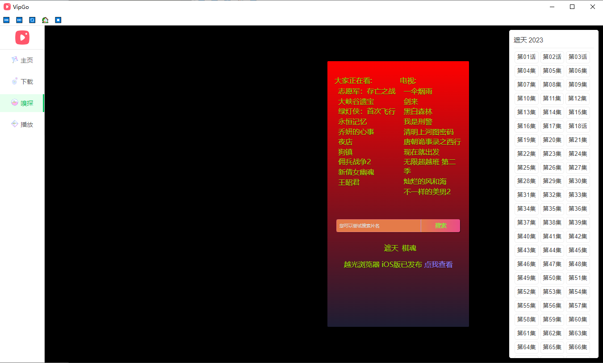
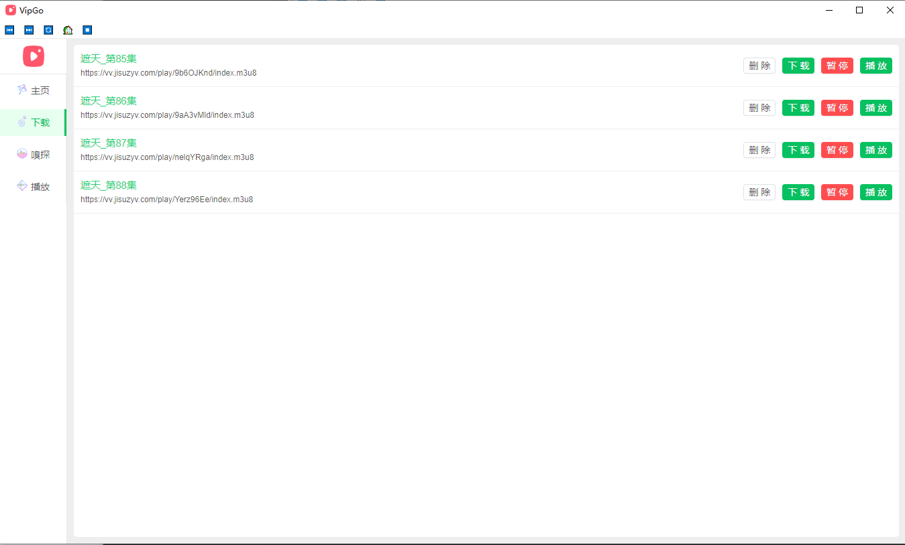

## 介绍

本项目支持 m3u8 视频在线下载,转为mp4格式,各平台视频Vip资源均可下载,

使用简单：嗅探页面输入电视剧、电影、动漫、短剧名称等 即可在线观看,

观看缓慢卡顿，请下载后观看更佳

- **✅&nbsp; 无需抓包**： 使用软件自带功能轻松嗅探网页中的视频资源，选择下载的资源，简单快速。
- **⚡️&nbsp; 批量下载**： 支持同时下载多个视频，高速带宽不闲置。

## 运行代码

```shell
# 代码下载
git clone https://github.com/yuxie2025/VipGo.git

# 安装依赖
npm i
cd frontend
npm i

# 前后端分开启动(开发环境)
# 启动前端vue
npm run dev
# 启动后端electron
npm run start

# 打包启动
npm run prod

# 打包并发布
npm run release

```

## 软件截图





## 技术栈

- electron <https://www.electronjs.org>
- vue3.0 <https://cn.vuejs.org/>
- vite <https://cn.vitejs.dev>
- antd <https://3x.antdv.com/docs/vue/introduce-cn>

## 鸣谢

- N_m3u8DL-RE 来自于 <https://github.com/nilaoda/N_m3u8DL-RE>
